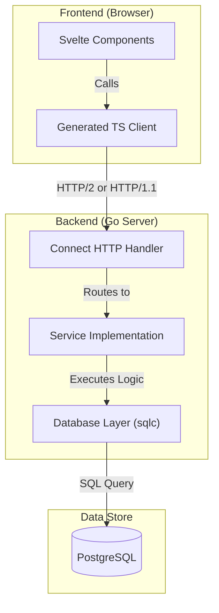

# Architecture & Contributing Guide

Welcome to the `godoit` project! This document is designed to help you understand the project's architecture, tech stack, and how to contribute effectively.

## 🏗 Tech Stack

This project is a full-stack application leveraging modern, type-safe tooling.

### Backend (Go)
*   **Language:** Go (1.25+)
*   **API Framework:** [Connect](https://connectrpc.com/) (gRPC-compatible, works over HTTP/1.1 & HTTP/2)
*   **Database:** PostgreSQL
*   **Database Driver:** `pgx/v5`
*   **ORM/Data Access:** [sqlc](https://sqlc.dev/) (Generates type-safe Go code from SQL)
*   **Migrations:** [Goose](https://github.com/pressly/goose) (implied by file structure)
*   **Environment:** `godotenv`

### Frontend (SvelteKit)
*   **Framework:** SvelteKit (Svelte 5)
*   **Language:** TypeScript
*   **Build Tool:** Vite
*   **Styling:** Tailwind CSS (v4) + DaisyUI
*   **API Client:** Generated Connect-ES client (type-safe fetch)

### Tooling
*   **Buf:** For managing Protocol Buffers and code generation.
*   **Bun/Node:** For frontend package management.
*   **Docker:** For running the local database.

---

## 📂 Project Structure

A "Monorepo-ish" structure containing both backend and frontend.

| Directory | Description |
| :--- | :--- |
| **`cmd/`** | Application entry points. `cmd/main.go` wires up the HTTP server, database connection, and services. |
| **`frontend/`** | The SvelteKit frontend application. |
| **`gen/`** | **[DO NOT EDIT]** Auto-generated backend code. Includes Go structs for Protobufs (`gen/todo/...`) and SQLC database code (`gen/database/...`). |
| **`internal/`** | Private application code. `internal/services/` contains the business logic implementing the gRPC interfaces. |
| **`proto/`** | Protocol Buffer definitions (`.proto` files). This is the **source of truth** for the API schema. |
| **`sql/`** | Database related files. `migrations/` for schema changes, `queries/` for SQL queries used by `sqlc`. |
| **`buf.yaml`** | Configuration for Buf (Protobuf linting/breaking change detection). |
| **`buf.gen.yaml`** | Configuration for code generation (Go & TypeScript). |
| **`sqlc.yaml`** | Configuration for `sqlc` (SQL -> Go generation). |

---

## 🧩 Architecture Overview

The system follows a **Schema-First** and **RPC** (Remote Procedure Call) design pattern.



### Data Flow
1.  **Define API:** You define a service in `proto/todo/v1/todo.proto` (e.g., `rpc CreateTodo`).
2.  **Generate Code:** `buf generate` creates:
    *   Go interface for the server (`gen/todo/v1/todov1connect/todo.connect.go`).
    *   TypeScript client for the frontend (`frontend/src/lib/gen/...`).
3.  **Implement Server:** The logic is written in `internal/services/todo.go`, which implements the generated Go interface.
4.  **Database Access:** Instead of writing manual SQL strings in Go, you write named queries in `sql/queries/*.sql`. `sqlc` generates type-safe methods (e.g., `queries.CreateTodo`) that are used by the service.
5.  **Consume in Client:** The frontend imports the generated client and calls methods like `client.createTodo()`. This provides full end-to-end type safety.

---

## 🚀 Development Workflow

### Prerequisites
*   Go 1.25+
*   Node.js or Bun
*   Docker (for Postgres)
*   CLI Tools: `buf`, `sqlc`, `goose` (optional, for migrations)

### 1. Start the Database
```bash
docker run --rm -it -e POSTGRES_USER=postgres -e POSTGRES_PASSWORD=postgres -e POSTGRES_DB=postgres -p 5432:5432 postgres:17
```
*Tip: Ensure your `.env` file matches these credentials.*

### 2. Run Migrations
Apply the database schema using `goose`:
```bash
# Navigate to the migrations directory if necessary, or point goose to it.
# Assuming you are at the project root:
goose -dir sql/migrations postgres "user=postgres password=postgres dbname=postgres sslmode=disable" up
```

### 3. Run the Backend
```bash
# Install dependencies
go mod download

# Run the server
go run cmd/main.go
```
The server will start on `http://localhost:8080`.

### 4. Run the Frontend
```bash
cd frontend

# Install dependencies
npm install # or bun install

# Start dev server
npm run dev
```
The frontend will be available at `http://localhost:5173`.

---

## 🛠 Making Changes

### Modifying the API
If you want to add or change an API endpoint:
1.  Edit `proto/todo/v1/todo.proto`.
2.  Run code generation:
    ```bash
    buf generate
    ```
3.  Implement the new method in `internal/services/todo.go`.
4.  Update the frontend to use the new method.

### Modifying the Database
If you need to change the schema or add queries:
1.  Add a migration file in `sql/migrations/` (e.g., `2024..._add_column.sql`).
2.  Add/Edit queries in `sql/queries/*.sql`.
3.  Run code generation:
    ```bash
    sqlc generate
    ```
4.  Use the new methods in your Go services.

---

## 🔍 Common Issues & Debugging

*   **CORS Errors:** Check `cmd/main.go` for the CORS middleware configuration. Ensure the frontend port is allowed.
*   **Database Connection:** Verify `.env` variables match your Docker container settings.
*   **Generation out of sync:** If the frontend complains about missing types, run `buf generate`. If the backend complains about missing DB methods, run `sqlc generate`.
