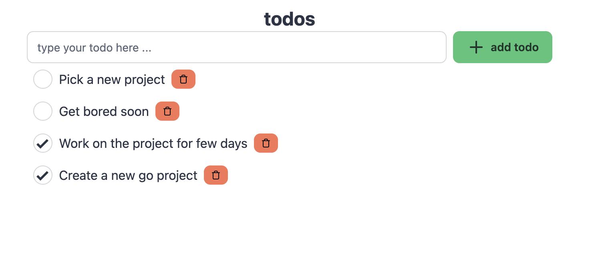

# Go do it
A simple todo app built as a learning experience.



### Tech Stack
- Go lang as backend language
- gRPC as the API layer
- PostgreSQL as Database
- Sqlc and Goose as Migration and Codegen tool
- SvelteKit as frontend SPA
- TailwindCSS with Daisyui

### Requirements
- Go
- Bun (or Node.js)
- Buf cli
- Docker (for postgresql)
- goose (go install github.com/pressly/goose/v3/cmd/goose@latest)
- sqlc (go install github.com/sqlc-dev/sqlc/cmd/sqlc@latest)

### Temp Postgresql container
```
docker run --rm -it -e POSTGRES_USER=postgres -e POSTGRES_PASSWORD=postgres -e POSTGRES_DB=postgres -p 5432:5432 postgres:17 
```
